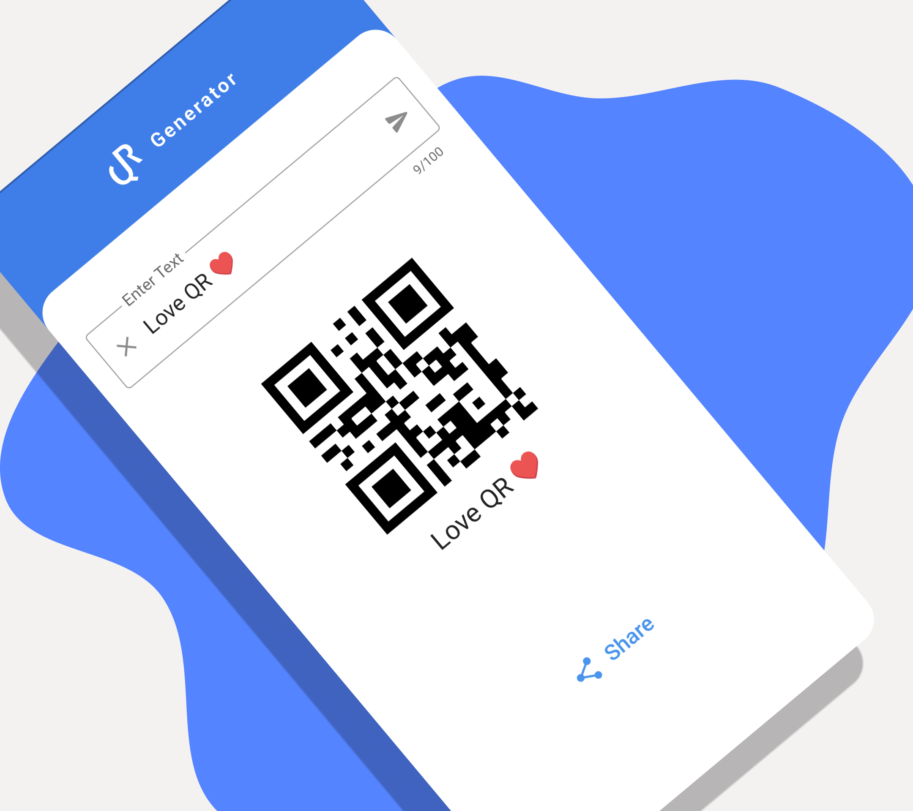
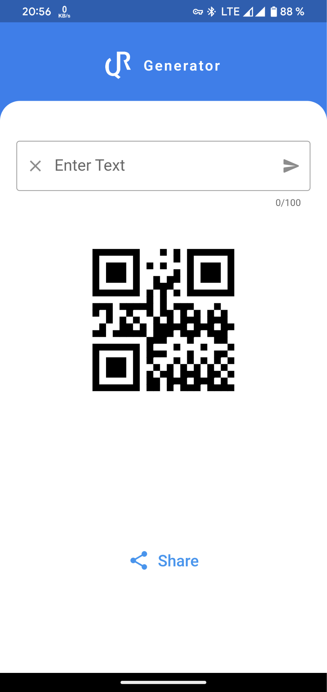
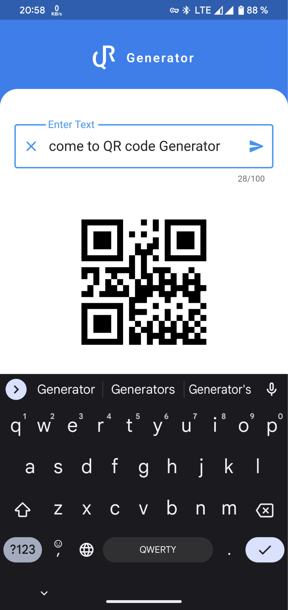
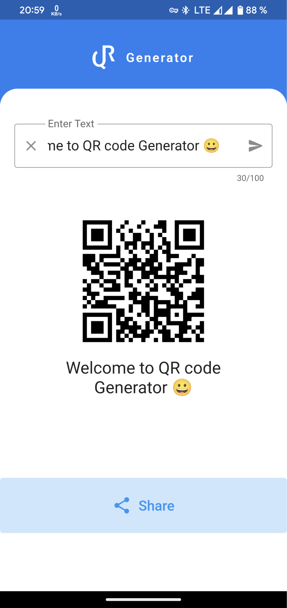
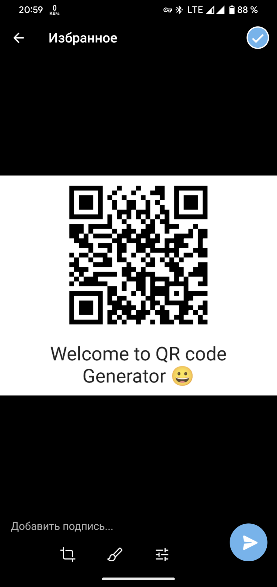

# QR Generator

Simple and fast QR code generator with the ability to share the QR code.
Supports letters, numbers, symbols and emoji

 Download from Google Play [QR Generator](https://play.google.com/store/apps/details?id=com.dblb.qr_generator.name)

 
 

 
  

